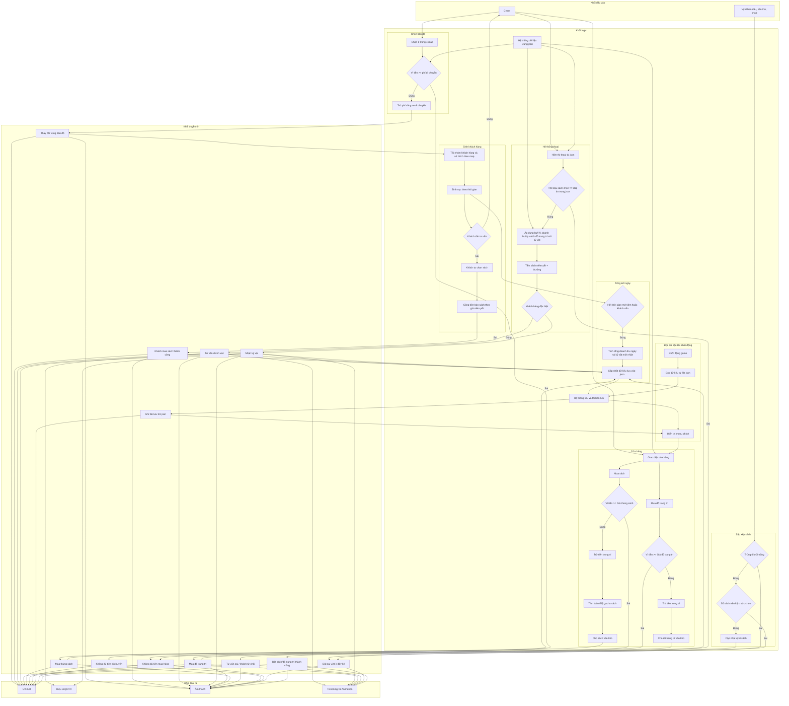

# ARCHITECTURE: Words on the Waves PH61823

**Last Updated:** 2026-07-04

## 1. Tổng quan hệ thống (System Overview)

Trò chơi sử dụng **Kiến trúc Hướng dữ liệu (Data-Driven Architecture)** kết hợp với **Máy trạng thái hữu hạn (FSM)** để quản lý luồng trò chơi và **Observer Pattern** để giao tiếp giữa các module.

## 2. Các Module Cốt lõi

### 2.1. FSM (Máy trạng thái hữu hạn)

Vòng lặp trò chơi được quản lý bởi các lớp State chuyên biệt kế thừa từ State cơ sở:

- `MainMenuState` (Menu chính)
- `CargoState` (Nhập sách)
- `PreparationState` (Sắp xếp kệ sách)
- `MapTravelState` (Di chuyển giữa các địa điểm)
- `ServiceState` (Phục vụ khách hàng)
- `DialogueListeningState` (Phân tích lời thoại khách hàng)
- `DaySummaryState` (Tổng kết cuối ngày)

_Quy tắc: Không được sử dụng cờ boolean lồng nhau để quản lý trạng thái trò chơi._

### 2.2. Quản lý dữ liệu (Data-Driven)

- Toàn bộ thông số kinh tế (kiện hàng, phí di chuyển, sách, chỉ số buff, lời thoại) đều được lưu trữ trong tệp `.json`.
- `DataManager` phân tích cú pháp và cung cấp dữ liệu này trên toàn hệ thống.
- Cấm tuyệt đối việc hardcode (viết chết) thông số vào mã nguồn.

### 2.3. Hệ thống Sự kiện (Observer Pattern)

- Giao tiếp giữa Gameplay cốt lõi, UI và Âm thanh sử dụng `Action` hoặc `UnityEvent`.
- Đảm bảo tính liên kết lỏng lẻo (loose coupling) giữa các thành phần.

## 3. Tương tác & Trải nghiệm (Interaction & Game Feel)

- **Kéo & Thả (Drag & Drop):** Sử dụng `Physics.Raycast` để tương tác với kệ sách 3D. Bao gồm việc hiển thị bóng mờ (Ghost Mesh preview) và tự động bắt dính (Snapping).
- **Tweening:** Phóng to (Scale Up) khi nhấc, Co giãn (Squash & Stretch) khi đặt xuống, Rung lắc (Shake) khi bị lỗi.
- **Âm thanh (Audio):** Thay đổi cao độ (Combo Pitch Shifting) khi bán hàng thành công liên tiếp. Âm lượng nhạc nền thay đổi tự động dựa trên khoảng cách đến bờ biển.

## 4. Tiêu chuẩn Hiệu năng (Performance Standards)

- **Zero GC:** Tuyệt đối không dùng `Find`, `GetComponent`, hoặc từ khóa `new` (tạo mới object/list/string) bên trong hàm lặp `Update`.
- **Object Pooling:** Bắt buộc sử dụng cho mô hình NPC, bong bóng thoại, icon sách và hiệu ứng chữ bay (floating text).
- **Số lượng Batches < 50:**
  - Sử dụng **Sprite Atlas** cho toàn bộ UI.
  - Áp dụng **Static Batching** cho môi trường tĩnh.
  - Kích hoạt **GPU Instancing / Dynamic Batching** cho các mô hình sách trên kệ.
  - Tách biệt UI Canvas tĩnh và động để ngăn tình trạng tính toán vẽ lại (rebuild) gây giật lag.

## 5. Quy chuẩn Quản lý Mã nguồn (Git & VCS)

- **Chuẩn Conventional Commits (Dành cho Solo Developer):**
  - **Cấu trúc linh hoạt:** `<type>: <description>` (Không cần quá khắt khe với phần `<scope>`, có thể bỏ qua cho nhanh gọn).
  - **3 loại (type) dùng 90% thời gian:**
    - `feat`: Khi code một cơ chế/tính năng mới (Ví dụ: `feat: làm chức năng kéo thả sách`).
    - `fix`: Khi game bị lỗi và bạn sửa nó (Ví dụ: `fix: sửa lỗi khách hàng sinh ra bị kẹt`).
    - `chore`: Khi không sửa code mà chỉ import thêm asset, đổi tên thư mục, chỉnh thông số trên Inspector (Ví dụ: `chore: import bộ asset âm thanh sóng biển`).
  - **Mục đích:** Giúp tìm lại code cực nhanh khi có bug (chỉ cần search `fix` hoặc `feat`) và tạo thói quen tốt để chuẩn bị cho môi trường studio lớn.
- **Lưu ý Cấu hình Unity & Git:**
  - Bắt buộc thiết lập **Asset Serialization** thành **Force Text** (`Edit > Project Settings > Editor`) để Git đọc được nội dung các file `.meta` hoặc Scene dưới dạng chữ.
  - _(Agent ghi nhớ: Chỉ viết commit message hỗ trợ copy-paste khi người dùng yêu cầu rõ ràng, tuyệt đối không tự ý chạy git commit hoặc sinh file gitignore)._
